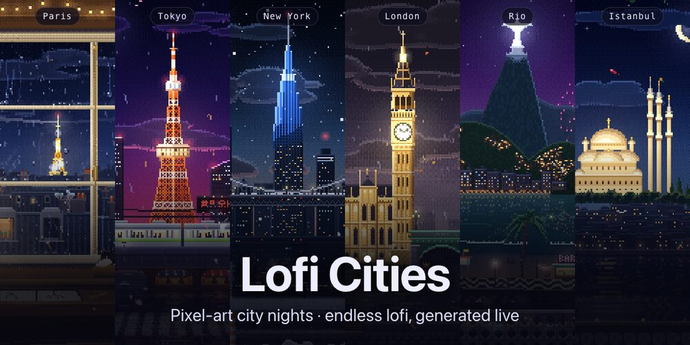
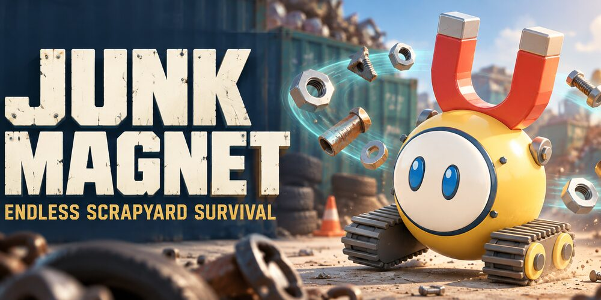
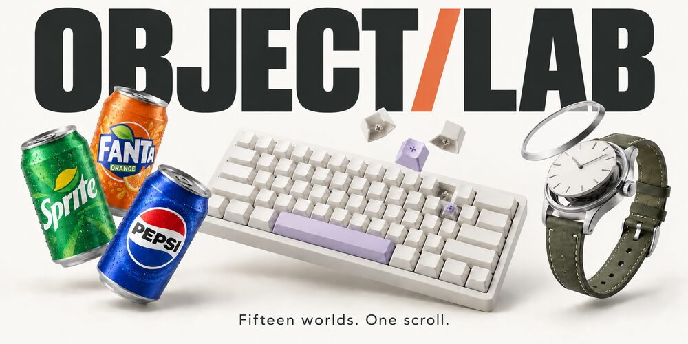
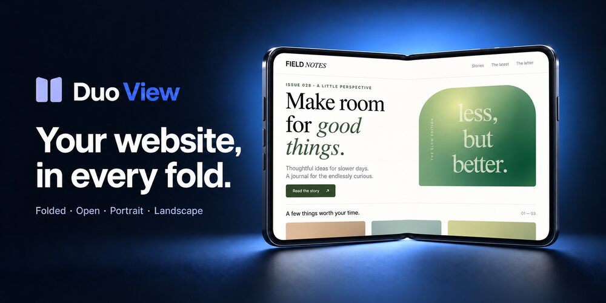

<h1 align="center">
  Hi , I'm Safa
</h1>

  <b>Software developer from Istanbul</b> · I build with AI 👨‍💻 · Game addict 🎮

  I make things you can open, play, and poke at right in your browser: 
  3D toys, arcade games, and small tools that feel good to use.

  
  
  
  
  
  
  

## 🎮 Things I've built

<table>
  <tr>
    <td width="33%" valign="middle">
      
    </td>
    <td colspan="2" valign="middle">
      🎧 NEW
       <b><a href="https://loficities.com">Lofi Cities</a></b>
       Pixel-art city nights in Paris, Tokyo, New York, London, Rio, and Istanbul, with endless lofi music composed live in your browser.
        
    </td>
  </tr>
  <tr>
    <td width="33%" valign="top">
      
       <b><a href="https://dualsense.studio">DualSense Studio</a></b>
       Your PS5 controller, in the browser.
         
    </td>
    <td width="33%" valign="top">
      
       <b><a href="https://playjunkmagnet.com">Junk Magnet</a></b>
       Endless scrapyard survival.
         
    </td>
    <td width="33%" valign="top">
      
       <b><a href="https://icy-tower-frostbound.netlify.app">Icy Tower — Frostbound</a></b>
       Arcade climber with online races.
         
    </td>
  </tr>
  <tr>
    <td width="33%" valign="top">
      
       <b><a href="https://object-lab-3d.netlify.app">Object Lab</a></b>
       15 scroll-driven 3D stories.
         
    </td>
    <td width="33%" valign="top">
      
       <b><a href="https://crema-barista-studio.netlify.app">Crema</a></b>
       Latte art lessons in 3D.
         
    </td>
    <td width="33%" valign="top">
      
       <b><a href="https://duo-view.netlify.app/studio/">Duo View</a></b>
       Preview sites on a foldable phone.
         
    </td>
  </tr>
</table>

…and more experiments in my <a href="https://github.com/SafaElmali?tab=repositories">repositories</a>.

## 🛠 Tools of the trade

  

---

  Enjoying something I made? It helps me keep building free tools and experiments.  
  

